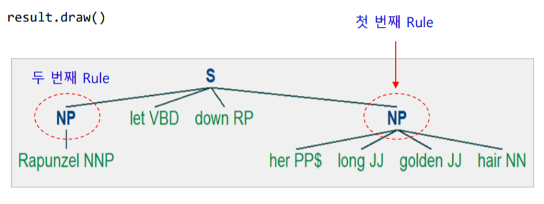

# NLP

* 정규표현식

* 청킹

* 칭킹


<br><br>

## 문서 정보 추출

<br>

### `정규표현식`

* 정해진 패턴을 사용해서 패턴에 일치하는 데이터 검색을 지원하는 표현식
* 정규표현식에 쓰이는 특수문자

  * `<.*>+` : 아무 문자나 여러 개 
  * `} {` : } { 안의 내용 제외   
  * `"\\n"` = `r"\n"`

* 읽어보기
  * DEVHolic. "정규표현식에 쓰이는 특수문자"](http://www.devholic.net/1000238351600)
  * Jungwoon. "파이썬으로 데이터 분석하기 #2"](https://jungwoon.github.io/python/2018/03/15/Data-Analysis-With-Python-2/)

<br>

 ### re 모듈 함수

* 읽어보기

[devanix. "파이썬 – 정규식표현식(Regular Expression) 모듈"](https://devanix.tistory.com/296)

<br>

<br>

### `청킹(Chunking)`

* 여러 개의 품사로 **구(pharase)를 만드는 것을 Chunking**이라 하고, 이 **구(pharase)를 chunk**라 한다.

* 문장을 각 품사로 구분하고, Chunking에 의해 구로 구분하면 문장의 의미를 파악하기 용이해 진다.

* 문장에서 (DT + JJ + NN), (DT + JJ + JJ + NN), (JJ + NN), 등의 시퀀스는 모두 명사구 (NP : Noun phrase)로 판단한다

* If a tag pattern matches at overlapping locations, the leftmost match takes precedence

  

<br>

* 순서

  1. grammar 정의

  2. 딕셔너리 정의: 
     cp = nltk.RegexpParser(grammar)

  3. sentence data 불러오기(혹은 테스트를 위해서라면 만들기)

  4. 딕셔너리에 따라 sentence 분석:

     cp.parse(sentence)

<br>

* Base code

  ```python
  import nltk
  grammar = 
  """
  NP: {<DT|PP\$>?<JJ>*<NN>}	  # rule 1
      {<NNP>+}                  # rule 2
  """
  
  cp = nltk.RegexpParser(grammar)
  
  
  sentence = [("Rapunzel", "NNP"), ("let", "VBD"), ("down",
  "RP"), ("her", "PP$"), ("long", "JJ"), ("golden", "JJ"),
  ("hair", "NN")]
  
  
  cp.parse(sentence)
  ```

  > (S
  > (NP Rapunzel/NNP)
  > let/VBD
  > down/RP
  > (NP her/PP$ long/JJ golden/JJ hair/NN))

  ``` python
  result.draw()
  ```




<br>

<br>

### `칭킹(Chinking)`

* 특정 부분을 chunk 밖으로 빼내는 것을 chinking이라 한다. 
  Chink는 문장에서 chunk를 제외한 나머지 부분을 의미한다

* 문장 전체를 chunk로 정의하고, 특정 부분을 chinking하면 나머지 부분이 chunk가 된다. 
  Chinking을 이용해서 chunking을 할 수도 있다

* code:


``` python
grammar = 
 r"""
NP:
{<.*>+}              # Chunk everything
}<VBD|IN>+{          # Chink sequences of VBD and IN(빼내는 부분)
"""

sentence = [("the", "DT"), ("little", "JJ"), ("yellow", "JJ"),
("dog", "NN"), ("barked", "VBD"), ("at", "IN"),
("the", "DT"), ("cat", "NN")]

cp = nltk.RegexpParser(grammar)
cp.parse(sentence)
```

> 

<br>

### Chunk의 구조 - `IOB tags`

* Chunk내의 각 품사의 위치에 따라 B (Begin), I (Inside), O (Outside)를 붙인다 (chunk tag). 
* B-NP는 NP chunk의 시작 부분을 의미하고, I-NP는 NP chunk의 내부 부분을 의미한다. 
* Chunk 구조는 IOB tags로 표현할 수도 있고, 트리 구조로 표현할 수도 있다. 
  * NLTK에서는 트리 구조를 사용한다.

> 

<br>

* *code* >

  * conll2000**.iob_sents**('train.txt')[99]

    > [('Over', 'IN', 'B-PP'), ('a', 'DT', 'B-NP'), ('cup', 'NN', 'I-NP'), ('of', 'IN', 'B-PP'), ('coffee', 'NN', 'B-NP'), (',', ',', 'O'), ('Mr.', 'NNP', 'B-NP'), ('Stone', 'NNP', 'I-NP'), ('told', 'VBD', 'B-VP'), ('his', 'PRP$', 'B-NP'), ('story', 'NN', 'I-NP'), ('.', '.', 'O')]

<br>

* 절(Clause)

  * 문법에 clause (절)를 정의하면 문장을 아래와 같이 분석 (chunking) 할 수 있다.

  * **Recursion in Linguistic Structure**

    ``` python
    grammar = r"""
    NP: {<DT|JJ|NN.*>+} # Chunk sequences of DT, JJ, NN
    PP: {<IN><NP>} # Chunk prepositions followed by NP
    VP: {<VB.*><NP|PP|CLAUSE>+$} # Chunk verbs and their arguments
    CLAUSE: {<NP><VP>} # Chunk NP, VP
    """
    cp = nltk.RegexpParser(grammar)
    sentence = [("Mary", "NN"), ("saw", "VBD"), ("the", "DT"), ("cat", "NN"),
    ("sit", "VB"), ("on", "IN"), ("the", "DT"), ("mat", "NN")]
    print(cp.parse(sentence))
    ```

    > (S
    > (NP Mary/NN)
    > saw/VBD
    > (CLAUSE
    > (NP the/DT cat/NN)
    > (VP sit/VB (PP on/IN (NP the/DT mat/NN)))))
    >
    > 

  * `.RegexpParser()`에 **loop = 2**를 지정하면 아래와 같이 clause 안에 또 다른 clause를 재귀적(recursion)으로 분석한다.
    이와 같이 문장에 맞게 트리를 깊게 구성하는 것을 `cascaded chunking (계단식 chunk)` 이라 한다.

    ``` python
    cp = nltk.RegexpParser(grammar, loop=2)
    print(cp.parse(sentence))
    ```

    > loop 걸어주면 절 속의 절이 들어가는 형태로 구분해준다.

    > (S
    > (NP John/NNP)
    > thinks/VBZ
    > (CLAUSE
    > (NP Mary/NN)
    > (VP
    > saw/VBD
    > (CLAUSE
    > (NP the/DT cat/NN)
    > (VP sit/VB (PP on/IN (NP the/DT
    > mat/NN)))))))
    >
    > 


<br>

### Named Entity Recognition (`NER`) - 개체명 인식

* NER 붙여놓으면 Q&A 가능하다(답을 찾아 제시해주는 챗봇 같은 거 만들 수 있음)

  ``` python
  sent = nltk.corpus.treebank.tagged_sents()[22]
  print(nltk.ne_chunk(sent, binary=True))
  ```

  > (S
  > The/DT
  > (**NE** U.S./NNP)
  > is/VBZ
  > one/CD
  > of/IN
  > ...
  > according/VBG
  > to/TO
  > (**NE** Brooke/NNP)
  > T./NNP
  > ...
  > the/DT
  > (**NE** University/NNP)
  > of/IN
  > (**NE** Vermont/NNP College/NNP)
  > of/IN
  > (**NE** Medicine/NNP)
  > ./.)
  * `binary=True` 안 쓰고 그냥하면 

    ``` python
    (nltk.ne_chunk(sent))
    ```

    > (S
    > The/DT
    > (**GPE** U.S./NNP)
    > is/VBZ
    > one/CD
    > of/IN
    > ...
    > according/VBG
    > to/TO
    > (**PERSON** Brooke/NNP T./NNP Mossman/NNP)
    > ...
    > the/DT
    > (**ORGANIZATION** University/NNP)
    > of/IN
    > (**PERSON** Vermont/NNP College/NNP)
    > of/IN
    > (**GPE** Medicine/NNP)
    > ./.)


<br>

<br>

<br>

<br>

* reference: 

  >* 아마추어 퀀트, blog.naver.com/chunjein
  >
  >* 코드 출처: 크리슈나 바브사 외. 2019.01.31. 자연어 처리 쿡북 with 파이썬 [파이썬으로 NLP를 구현하는 60여 가지 레시피]. 에이콘
  >
