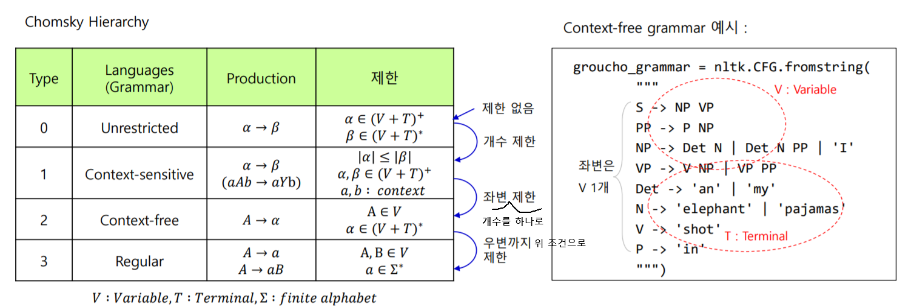
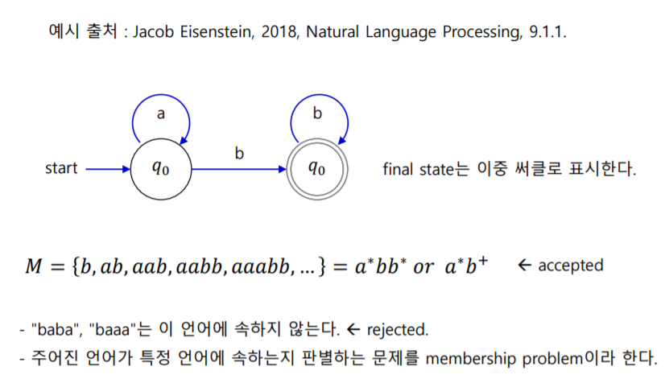

# NLP

* 형식언어 이론
  * Context-free Grammar
  * Context-sensitive Grammar
  * Natural Language


<br>

## 문장 구조 분석

* Word-salad(말비빔): 문법적으로는 완벽히 맞지만 의미가 없는 문장
* 2020-07-17~
* P. 122~


### 형식언어 이론 : Formal Language Theory

* 언어란?

  * (형식적 측면) 유한개의 철자로 무한개의 단어와 문장을 조합한 것
  * (의미적 측면) 무한한 의미를 생성할 수 있는 것 

* 촘스키의 계층 구조 (Chomsky Hierarchy)

  * ==의미 없이 문장이 형성되는 과정을 형식으로 설명 : `형식언어(formal language theory)`==
  * groucho_grammar = `nltk.CFG.fromstring(""" V와 T로 문법 정의 """)`
    * V : `Variable`
    * T : `erminal`

  * 
    * Context-free grammar에서, 우변 -> 좌변(Variable, Terminal)일 때 '->'하는 과정 : `derivation`
    * Unrestricted: 자연어(사람 말)
    * Context-sensitive부터 Regualr까지 오토마타(Automata)

  

  ### `오토마타(Automata)`

  * 어떤 Language가 어떤 Grammar에 따르는지 그래서 Accept할지, Reject할지 Check하는 추상적인 기계(장치)
* 
  
  * `Unrestricted(Natural Language)`
* Type-0 : Recognized by Turing Machine
  * `Context-sensitive` 
    * Type-1 : Accepted by Linear Bound Automata
  * `Context-free` 
    * Type-2 : Accepted by Push Down Automata (PDA)
  * `Regular` 
    * Type-3 : Accepted by Finite State Automata (FSA)
  
  
  
  
  
  
  
  ### Regular Grammar
  
    * 결정적 유한 오토마타(Deterministic finite automaton, DFA)
    * Regular 언어에서 오토마타는, 어떤 게 어디 속하는지에 관한 문제인 membership porblem 판별장치
    * print(FSA('aabbb')):
  
  | derivation                                                   | a*b+ | Automata | Grammar                                                      |
  | ------------------------------------------------------------ | ---- | -------- | ------------------------------------------------------------ |
  | a**s** -> <br />aa**s** -> <br />aaa**s** -> <br />aaaa**A** -> <br />aaaab**B** -> <br />aaaabb**B** -> <br />aaaabbb |      |          | S -> aS<br />S -> aA<br />A -> bB<br />B -> b<br /><br />-S -> as \| aA<br />A -> bB \| b |
  
    >  Chomsky Hierarchy 中 **Regular** Grammar
    >
    > 
  
  
  
  
    * 정규언어 (Regular language) 와 유한상태 인식기 (Accepted by Finite state acceptor : **FSA**)
  
  ``` python
  init_state = 0
  final_state = [1]
  trap_state = 2
  delta = {0: {'a':0, 'b':1}, 
         1: {'a':2, 'b':1}}
  
  """
  {현재상태 0 {'a' 들어가면: 다음 상태는 0, 'b' 들어가면: 다음 상태는 1}}
  {현재상태 1 {'a' 들어가면: 다음 상태는 2, 'b' 들어가면: 다음 상태는 1}}
    """
  
  def FSA(string):
      state = init_state  # 초기상태 = 0
      for s in string: 	# 'a' 들어가고 'a' 들어가고 'b' 들어가는 등 하나씩 for문에 입력됨! 
          state = delta[state][s]
          if state == trap_state: # state가 2가 되면 멈춤. 즉, 1상태에서 'a'가 들어오면 멈춤
              					# 즉, 문자열을 읽어가다가 trap state에 빠지면 reject 됨 
              break
    
      return state in final_state # state값이 final_state에 있으면 True, 없으면 False
  
  print(FSA('aabbb')) # True
  print(FSA('aabba')) # False
  print(FSA('aabbc')) # error
  print(FSA('a'))     # False
  ```


<br>

  ## Context-free Grammar

  * Accepted by Push Down Automata, PDA
  
    * {a의 n승 b의 n승, n>=1}가 aaaabbbb라는 오토마타 형태(뭐다음 뭐 나와야 하고, 뭐 다음 뭐 나와야 하는 것)을
    기계는 기억하지 못함.
      ex: N의 n승 N의 n승 -> the cat(N) the dog(N) chased(V) run(V)

  * 이때, 과거 데이터를 기억하는 오토마타의 장치: Stack
  
    
    
    > Chomsky Hierarchy 中 **Context-free** Grammar
    >
    > 


<br>

  ## Context-sensitive Grammar

* 좌우 문맥에 따라 달라지는 경우
  
  * S -> NP VP
  * aSb -> NP VP
  * cSd -> NP PP
  * aSb -> aS by
  * bSa -> aA bb
  
* Accepted by Linear Bound Automata

* '한글모아쓰기'에 활용되기도 함

  

  > Chomsky Hierarchy 中 **Context-sensitive** Grammar
  >
  > 


<br>

  ## Unrestricted Grammar (Natural Language)

  * Recognized by Turing Machine
  * 의미는 틀려도 되고, 아무 단어나 막 조합해도 되는 것


<br>

<br>

<br>


* 참고: 

  >* 아마추어 퀀트, blog.naver.com/chunjein
  >
  >* 코드 출처: 크리슈나 바브사 외. 2019.01.31. 자연어 처리 쿡북 with 파이썬 [파이썬으로 NLP를 구현하는 60여 가지 레시피]. 에이콘